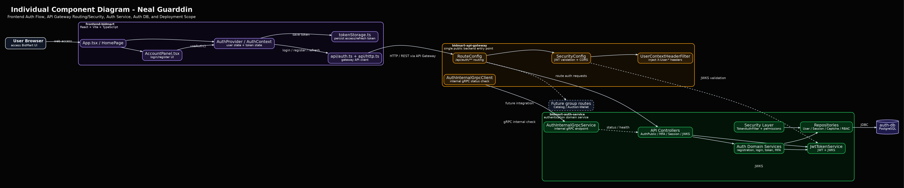
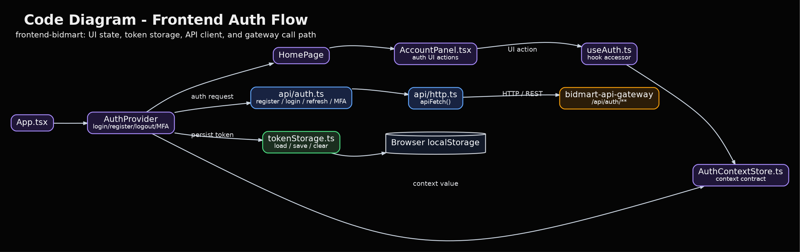
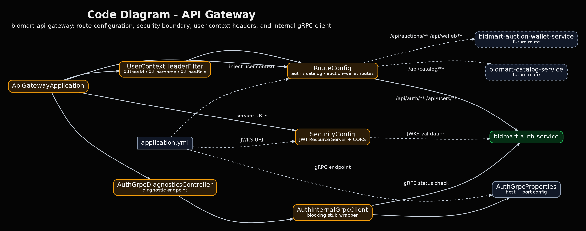
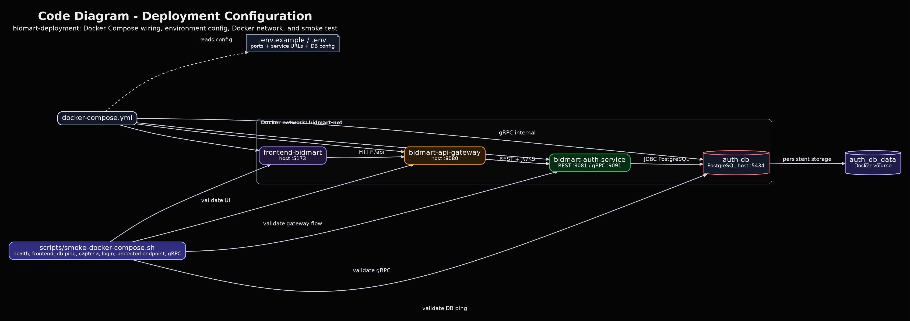

# Individual Architecture Documentation - Neal Guarddin

Dokumentasi ini dibuat untuk memenuhi bagian **Individual Work** pada Tutorial B: Visualizing and Architectural Risk.

Repository ini digunakan sebagai tempat commit individual karena bagian pekerjaan saya berhubungan langsung dengan `bidmart-auth-service` dan integrasinya dengan `frontend-bidmart`, `bidmart-api-gateway`, serta `bidmart-deployment`.

---

## Identitas

| Informasi | Detail |
|---|---|
| Nama | Neal Guarddin |
| NPM | 2406348282 |
| Kelompok | BidMart A01 |
| Kelas | Advance Programming A |

---

## Ringkasan Individual Work

Berdasarkan container diagram group, bagian individual saya berfokus pada core authentication flow BidMart:

```text
frontend-bidmart -> bidmart-api-gateway -> bidmart-auth-service -> auth-db
```

Pada flow tersebut, frontend tidak memanggil Auth Service secara langsung. Semua request dari frontend masuk melalui API Gateway. API Gateway kemudian meneruskan request authentication ke Auth Service, sedangkan Auth Service bertanggung jawab terhadap login, register, token/session handling, JWT/JWKS, MFA, gRPC internal endpoint, dan akses ke `auth-db`.

---

## Korelasi dengan Group Container Diagram

Group container diagram menunjukkan struktur besar sistem BidMart. Bagian yang saya perluas pada individual diagram adalah container yang berhubungan langsung dengan authentication flow:

| Group Container | Detail pada Individual Diagram |
|---|---|
| `frontend-bidmart` | Login/Register UI, Auth Provider, token storage, dan API client |
| `bidmart-api-gateway` | Routing, JWT validation, security boundary, dan gRPC client |
| `bidmart-auth-service` | Controller, service layer, security layer, repository layer, JWT/JWKS, session, MFA |
| `auth-db` | Penyimpanan data autentikasi |

Dengan demikian, individual diagram ini bukan menggambar ulang seluruh sistem, tetapi melakukan zoom-in pada bagian yang saya kerjakan.

---

# Individual Component Diagram



Component diagram ini memperluas container diagram group dengan fokus pada bagian authentication flow. Diagram ini menunjukkan hubungan antara frontend authentication components, API Gateway routing/security components, Auth Service components, dan `auth-db`.

Komponen utama yang ditampilkan adalah:

| Area | Komponen |
|---|---|
| Frontend | Account UI, Auth Provider, API client, token storage |
| API Gateway | Route configuration, security configuration, user context filter, gRPC client |
| Auth Service | Auth controllers, JWT/JWKS, MFA, session handling, repository layer |
| Database | `auth-db` sebagai persistence layer untuk data authentication |

---

# Code Diagram: Frontend Auth Flow



Code diagram ini menunjukkan struktur frontend authentication flow. UI seperti login/register tidak langsung menyimpan logic API, tetapi menggunakan auth context/provider. Request authentication dikirim melalui API client ke API Gateway, sedangkan token disimpan dan dikelola melalui token storage.

Alur utamanya adalah:

```text
Login/Register UI -> Auth Provider -> Auth API Client -> API Gateway
```

Diagram ini penting karena menunjukkan bahwa frontend memiliki separation of concern antara UI, state management, API communication, dan token persistence.

---

# Code Diagram: API Gateway



Code diagram ini menunjukkan struktur API Gateway sebagai single public backend entry point.

API Gateway bertanggung jawab untuk:

- menerima request dari frontend;
- menentukan route ke service tujuan;
- melakukan security validation;
- meneruskan user context ke service internal;
- menyediakan komunikasi internal ke Auth Service melalui gRPC.

Pada authentication flow, gateway meneruskan request ke `bidmart-auth-service`. Untuk pengembangan berikutnya, gateway juga dapat meneruskan request ke service lain seperti Catalog Service dan Auction-Wallet Service.

---

# Code Diagram: Auth Service


Code diagram ini menunjukkan struktur internal `bidmart-auth-service`.

Auth Service dipisahkan menjadi beberapa layer:

| Layer | Tanggung Jawab |
|---|---|
| API Layer | Menerima request seperti register, login, refresh token, MFA, session, dan JWKS |
| Security Layer | Token authentication, permission enrichment, dan security configuration |
| Service Layer | Business logic untuk registration, login, token, captcha, MFA, dan JWT |
| Repository Layer | Akses data ke `auth-db` |
| Database | Penyimpanan data user, session, captcha, MFA, dan RBAC |

Pemisahan layer ini membantu maintainability karena controller, business logic, security, dan persistence tidak dicampur dalam satu bagian kode yang sama.

---

# Code Diagram: Deployment Configuration



Code diagram ini menunjukkan bagaimana repository deployment menghubungkan service utama pada core Auth flow.

Komponen deployment yang relevan adalah:

| File/Komponen | Fungsi |
|---|---|
| `docker-compose.yml` | Menjalankan frontend, API Gateway, Auth Service, dan Auth DB |
| `.env.example` / `.env` | Menyediakan konfigurasi environment |
| `frontend-bidmart` | UI yang diakses user |
| `bidmart-api-gateway` | Public backend entry point |
| `bidmart-auth-service` | Service authentication |
| `auth-db` | Database PostgreSQL untuk Auth Service |
| `scripts/smoke-docker-compose.sh` | Validasi stack deployment |

Diagram ini menunjukkan bahwa kontribusi individual tidak hanya berada pada code service, tetapi juga pada integrasi deployment agar frontend, gateway, auth service, dan database dapat berjalan sebagai satu flow.

---

# Kesimpulan

Individual work ini memperluas group container diagram dengan fokus pada authentication flow BidMart. Diagram yang disediakan menunjukkan hubungan antara container utama, detail component di dalamnya, dan struktur code yang mendukung implementasi.

Bagian ini memenuhi kebutuhan individual work karena mencakup:

- satu individual component diagram;
- beberapa code diagram;
- korelasi yang jelas dengan group container diagram;
- hubungan langsung dengan repository `frontend-bidmart`, `bidmart-api-gateway`, `bidmart-auth-service`, dan `bidmart-deployment`.
